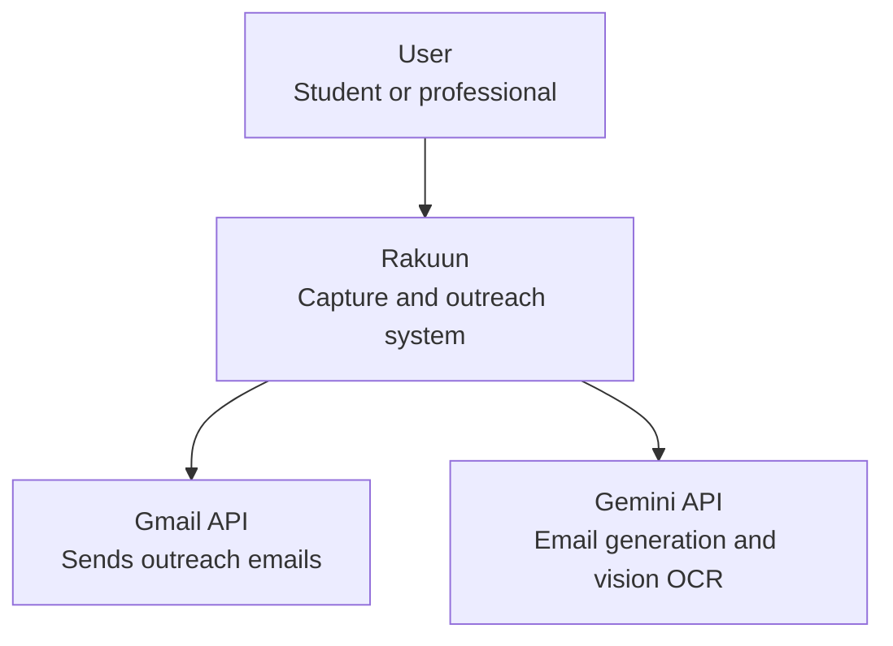
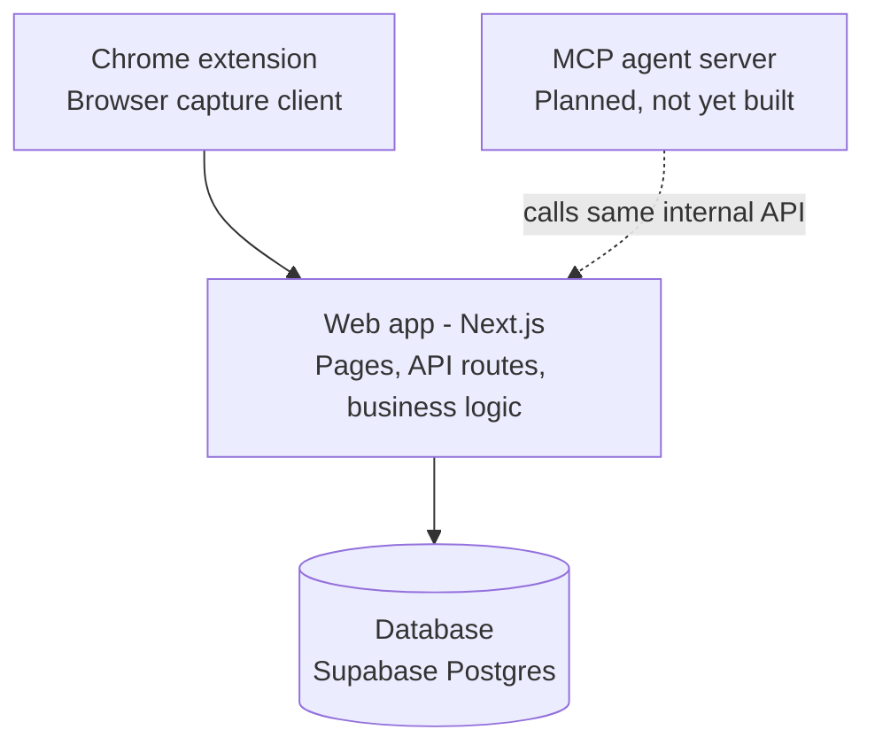
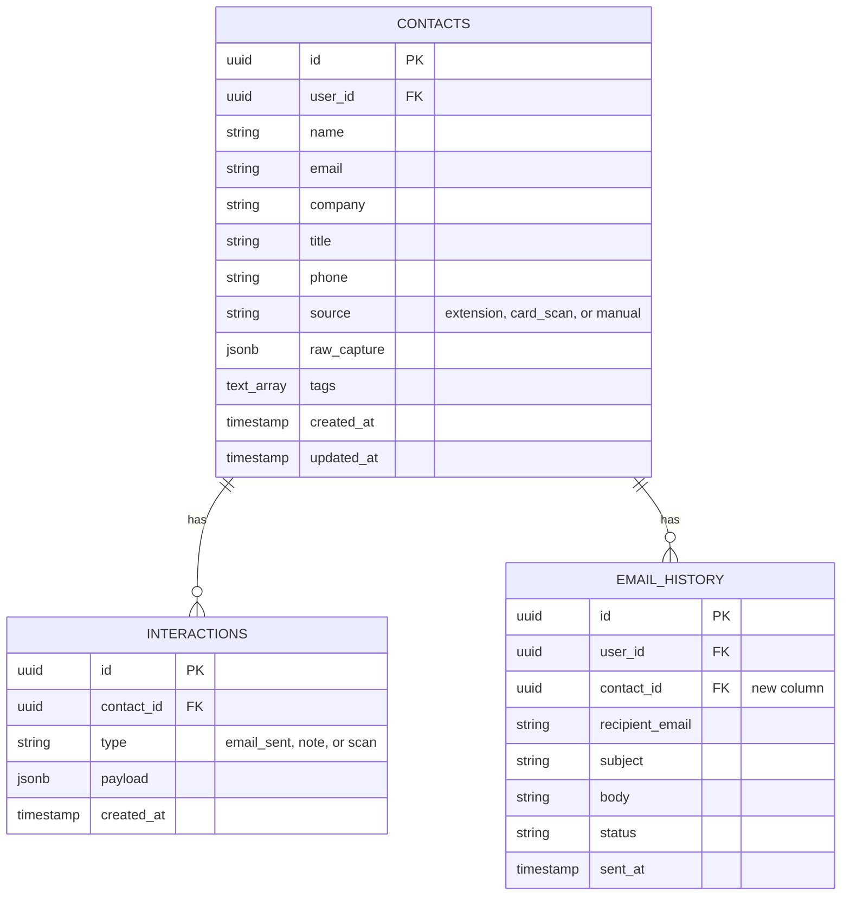

# Architecture — rakuun

This document captures the reasoning behind the system's design, not just the design itself: the drivers that shape it, the decisions made and why, and where it's headed. See `CLAUDE.md` for a fast-reference summary aimed at coding agents.

## 1. What this is

Rakuun is a contact-capture and outreach tool with three surfaces:

1. A **Chrome extension** that generates a personalized email from selected webpage text and sends it via Gmail.
2. A **web app** for scanning business cards into structured contacts.
3. A **dashboard**, eventually backed by an **MCP agent layer**, that uses the combined contact data for follow-ups, scheduling, and other automation.

Distribution model: open source and self-hosted. Each deployment is single-tenant — one developer, their own Supabase project, their own Gemini and Google OAuth credentials. There is no shared backend to operate, which removes deliverability infrastructure, multi-tenant billing, and abuse-handling from the project's scope entirely.

## 2. Architectural drivers

The requirements that actually shape structural decisions (as opposed to the many that don't):

- **D1 — Convergence.** Two structurally different capture methods (a DOM selection, a photo) must produce one queryable model. The dashboard and any future agent need a single "who do I know," not two.
- **D2 — Agent-readiness.** The data/API layer built now is the interface contract an MCP agent will call later. It needs to stay clean enough that adding agents is additive, not a rewrite.
- **D3 — Solo development, short cycles.** Favor a monolith and fewer moving parts over a "textbook correct" distributed system.
- **D4 — Self-hosted, single-tenant.** No shared infrastructure to design for; each instance is independent.
- **D5 — Real personal data.** Names, emails, phone numbers, and photos of business cards need a baseline privacy posture even at MVP stage — least-retention, no silent third-party leakage, editable/deletable records.

## 3. Constraints

- Existing stack: Next.js 15 (App Router) + TypeScript, Supabase (Postgres, Auth, RLS), Gemini API, Gmail API via OAuth, Chrome MV3 extension.
- MV3 service workers cannot hold long-running state — extension logic must be stateless/event-driven.
- Current codebase already has a working extension → Gemini → Gmail send path (see `CLAUDE.md` for exact state), which any new design should extend rather than replace.

## 4. System in context

At the highest level, the system's boundary doesn't distinguish monolith from microservices — it only shows who calls it and what it calls.

## 5. Key decisions

Each of these follows the same shape: context, decision, consequences. They're the things that would be expensive to reverse later — everything else is left to normal engineering judgment.

### ADR-001: One unified `contacts` model, not one table per capture surface

- **Context:** the extension captures a DOM selection; the card scanner captures a photo. Structurally different inputs, driven by D1.
- **Decision:** a single `contacts` table with a `source` enum (`extension` | `card_scan` | `manual`) and a `raw_capture` JSONB column for source-specific extras (e.g. the original selected text, or the raw Gemini OCR output).
- **Consequences:** the dashboard and any future agent query one shape. The cost is schema flexibility has to live in `raw_capture` rather than typed columns for source-specific fields.

### ADR-002: All contact reads/writes go through one internal API layer

- **Context:** driven by D2 — whatever boundary exists between clients and the database becomes the agent's interface later.
- **Decision:** a single `/api/contacts/*` route family (upsert, list, get, log-interaction). The extension, the card-scanner web app, the dashboard, and eventually the MCP server all call this layer — none of them query Supabase directly except this layer.
- **Consequences:** one extra hop per call, in exchange for the agent layer being an adapter on top of proven logic instead of a reimplementation of it.

### ADR-003: Supabase Auth is the single identity system

- **Context:** the current codebase has two identity-adjacent flows — `chrome.identity.getAuthToken` (a raw Google token, used today only to call Gmail) and a bespoke `user_sessions` table created by `create-session/route.ts` that also stores that same Google token. Neither is Supabase's own session system, and RLS policies are written against `auth.uid()`, which only exists if Supabase Auth is actually used to sign in.
- **Decision:** Supabase Auth is the one identity system the app trusts. The Google OAuth token obtained via `chrome.identity` is used only for its `gmail.send` scope — never as a stand-in for "who is this user." The bespoke session table is not extended further.
- **Consequences:** RLS stays simple and consistent everywhere. The cost is reconciling the existing `create-session`/`validate-session` scaffolding, which currently conflates the two.

### ADR-004: The future MCP agent layer calls the internal API, never the database directly

- **Context:** driven by D2 and ADR-002.
- **Decision:** when built, the MCP server's tools (`list_contacts`, `get_contact`, `draft_followup`, `log_interaction`, etc.) call `/api/contacts/*` over HTTP, not Postgres directly.
- **Consequences:** the agent can later move to its own long-running process (agents often need to run outside a request/response lifecycle) as a redeploy, not a rewrite, because it never depended on being in-process with the database client.

### ADR-005: Typed REST/RPC endpoints as MCP tools, not GraphQL

- **Context:** GraphQL's value is letting a client shape an arbitrary nested query without a backend change per view — a frontend-flexibility problem. MCP tool-calling already gives an agent a fixed, typed input/output schema per tool; there's no arbitrary traversal happening, so GraphQL's benefit doesn't apply, and query *performance* is identical either way since both sit on the same Postgres underneath.
- **Decision:** contact-related MCP tools wrap narrow, typed REST/RPC endpoints. A future dashboard UI may use `pg_graphql` (built into Supabase) for flexible nested queries, but that's a UI-layer decision made independently.
- **Consequences:** agent calls stay simple, auditable (log tool name + args), and cheap to sandbox. No resolver layer or N+1 batching concerns to maintain.

### ADR-006: Google sign-in through Supabase Auth covers both identity and Gmail access

- **Context:** the extension previously obtained a Google access token via `chrome.identity.getAuthToken()` purely to call Gmail, with Supabase Auth (and the bespoke `create-session` table) as a separate, unused identity path. ADR-003 established that Supabase Auth must be the one identity system; this decision specifies how it also covers Gmail access.
- **Decision:** the extension signs in via Supabase's Google provider, requesting the `gmail.send` scope with `access_type=offline` and `prompt=consent`. The resulting session provides both a real Supabase identity (`auth.uid()` for RLS) and Google's own tokens (`session.provider_token`, `session.provider_refresh_token`) for calling the Gmail API directly — one OAuth broker instead of two.
- **Consequences:** the `create-session`/`validate-session` routes and the `user_sessions` table are no longer needed and should be removed. `gmail.send` remains a sensitive Google scope requiring app verification regardless of which OAuth path is used to request it.
- **⚠️ Partially superseded by ADR-008.** The identity half of this decision stands and is implemented: sign-in goes through Supabase's Google provider via PKCE. The Gmail half does not — `session.provider_token` does not survive a session refresh, so ADR-008 moves Gmail access back to `chrome.identity.getAuthToken()`. `access_type=offline` / `prompt=consent` are consequently no longer requested.

### ADR-007: Cloud-hosted Supabase only, no self-hosted Docker option

- **Context:** self-hosting would require running Supabase's full stack (Postgres, GoTrue, Kong, PostgREST, Realtime, Storage, Studio) via Docker to preserve Auth and RLS — a bare Postgres container alone would lose both. That's meaningfully heavier ops for each developer deploying their own instance than the project's "self-hosted, BYO credentials" model needs.
- **Decision:** each deployment uses a developer's own Supabase cloud project (the free tier is sufficient at this scale). No self-hosted Docker Compose stack is provided or documented.
- **Consequences:** setup for a new developer stays at "create a Supabase project, paste three env vars" rather than operating multiple containers and a reverse proxy. The trade-off is a dependency on Supabase's cloud service rather than a fully self-contained deployment — acceptable given the project's actual goal is easy per-developer setup, not zero third-party dependency.

### ADR-008: Gmail access is brokered by Chrome, not by Supabase's `provider_token`

- **Context:** ADR-006 assumed the Supabase session could carry Gmail access indefinitely via `session.provider_token`. It cannot. Supabase returns `provider_token` and `provider_refresh_token` on the **initial sign-in response only**; it does not persist them and does not return them after a session refresh. So a `provider_token`-based implementation stops sending roughly an hour after sign-in, when the first refresh drops the Google token. Refreshing that token directly against Google requires the OAuth **client secret**, which a Chrome extension cannot hold.
- **Decision:** split the two concerns. Supabase Auth remains the sole identity system (ADR-003, unchanged) — the extension signs in through Supabase's Google provider using the PKCE flow driven by `chrome.identity.launchWebAuthFlow`, and the resulting Supabase access token is what authenticates calls to `/api/*`. Gmail access is obtained separately via `chrome.identity.getAuthToken`, which brokers the `gmail.send` token and refreshes it natively with no client secret. The extension requests Gmail consent lazily, on first send, rather than at sign-in.
- **Consequences:** the extension works end to end today with no server-side token storage. ADR-006's "one OAuth broker instead of two" goal is given up; its underlying goal — *one identity system* — is fully preserved, because the Google token is never treated as identity. The costs are two Google OAuth clients per deployment (Supabase needs a *Web application* client; `getAuthToken` needs a *Chrome Extension* client — these cannot be the same client) and two consent prompts on first use.
- **The alternative, and when to revisit:** the backend could hold the client secret, store `provider_refresh_token` server-side encrypted, and mint Gmail tokens itself. That is arguably cleaner — one OAuth client, one consent, and the extension would stop handling Google credentials entirely — but it requires an encrypted token store and refresh logic before Gmail send works at all. Revisit when Calendar OAuth arrives (Phase 1) and a shared server-side token store starts paying for itself. The entire reversal surface is `extension/gmail-auth.js` plus the `userToken` field in the send request; nothing else depends on where the Gmail token comes from.

## 6. Containers

Zooming into "Rakuun" from the context diagram — same shape, one level deeper. The MCP agent server is drawn dashed because it doesn't exist yet.

## 7. Data model

`contacts` and `interactions` are defined in `supabase/migrations/`. `email_history` gains a `contact_id` foreign key so historical sends link to the unified model.

RLS on `contacts` and `interactions` follows the existing pattern: `auth.uid() = user_id` (directly on `contacts`, and via a join through `contacts` for `interactions`). Update policies carry `WITH CHECK` as well as `USING`, so a row can't be reassigned to another user.

Three details the diagram doesn't show, settled when the migration was written:

- **`email` is nullable** — business cards routinely carry a phone number and no email.
- **Deduplication is `UNIQUE (user_id, email)`, a plain constraint.** Postgres treats NULLs as distinct, so email-less contacts never collide with each other, and a plain constraint is the only form `upsert({ onConflict: 'user_id,email' })` can target — a partial index would break every upsert.
- **Emails are stored lowercase**, enforced by a `CHECK`, so casing can't split one person into two contacts.

`tags` is `text[]` rather than the `jsonb` originally sketched: the column holds plain word labels, and `text[]` makes the database reject anything that isn't a list of strings instead of silently accepting a shape the tag filter will never match.

## 8. Roadmap

**Phase 0 — MVP (build first):**

0. ~~Give the extension a real Supabase session (ADR-006 identity half + ADR-008).~~ **Done.** This has to precede everything below it: `/api/contacts` enforces access through RLS on `auth.uid() = user_id`, and `auth.uid()` only exists if the caller presents a Supabase session. Without it, step 3 could only be built by passing a client-supplied `user_id` to a service-role client — reintroducing the exact hole that made `create-session` unsafe.
1. ~~Migrate the schema: add `contacts` and `interactions`, add `contact_id` to `email_history`.~~ **Done.** `setup.sql` is replaced by ordered, idempotent migrations under `supabase/migrations/`; `contacts` carries the `UNIQUE (user_id, email)` constraint the upsert-by-email pattern requires.
2. Build the shared `/api/contacts` endpoint (upsert-by-email, list, get).
3. Wire the extension's send flow to upsert a contact alongside sending the email.
4. Build the business card capture page: camera/file input → Gemini vision extraction → editable confirm form → save via the same endpoint.
5. Build a bare-bones dashboard: contact list, source badges, search, per-contact interaction history.
6. Run one real end-to-end test across both capture paths.

**Phase 1 — robustness (after the MVP proves the loop):**

- MCP server exposing `/api/contacts/*` as tools; agent-driven follow-up drafting.
- Google Calendar OAuth + scheduling, following the same OAuth pattern already used for Gmail.
- ~~Fix the bugs in `extension/supabase-client.js` and wire it into `popup.js`.~~ **Done** — moved to Phase 0 step 0, where it belongs. Removing `create-session`/`validate-session`/`user_sessions` is now unblocked and should happen immediately: they are unauthenticated service-role writes, so leaving them deployed is a live security hole, not dead code.
- OAuth verification path for Gmail's `gmail.send` scope if this moves beyond personal/closed-beta use.
- Entity resolution beyond exact-email matching.
- Retention/deletion policy for business card photos.

**Explicitly deferred, no committed timeline:** deal pipelines, team/multi-user features, integrating an external open-source CRM. Revisit only if a real need for pipeline-style features emerges — see ADR-001 through ADR-004 for why the current plan is a purpose-built model instead.
